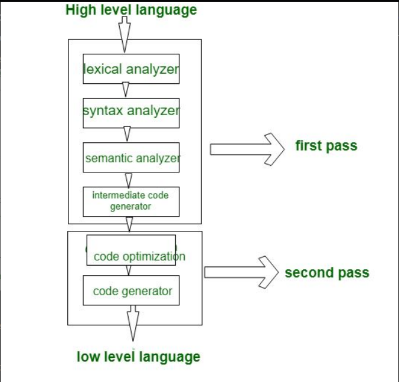
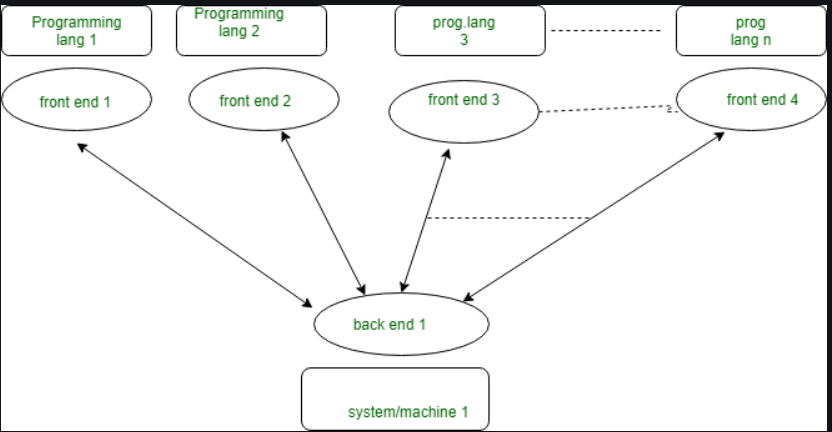

# Compiler Basics

### Single, Two, and Multi Pass Compilers

Define and explain the similarities and differences between these types of compilers:

A key concept of compiler construction is a _pass_. A pass is defined as a complete traversal of the source code to be compiled. How many passes that a compiler designer may choose to use depends on the limitations of hardware and the complexity of the language. Generally, a simple language may be able to process the source code in a single pass where a more complex language would require more [1].

**Single Pass Compiler**

A single pass compiler does all compilation steps in a single pass. This is usually easier to implement as well as computationally faster since it only processes the source code once. However, further code optimizations may not be found.

 [2]

This type of compiler is almost never seen in the wild. It is more of an academic exercise. An early version of Pascal did use this design [2].

**Two Pass Compiler**

Compilation in two passes may be computationally slower, but provides opportunities for further optimization of the source code. The image below breaks the process into to parts:

1. Does the analysis and generates intermediate code
2. Does a pass of the intermediate code to further optimize before it generates the final code

 [2]

Still more optimizations can be found if the compiler is allowed more passes.

**Multi-Pass Compiler**

When a compiler design involves multiple passes the steps are further broken down. This provides specific checks and optimizations on each pass.

 [2]

Most compilers at the time of writing use this design as it allows languages to run on different operating systems and hardware. It handles complex high level languages well and provides the most optimizations for the source code. Although multiple passes does take longer the trade off here is that the checks and optimizations achieved through each pass provide more reliable and fast software in the long run.

### Bibliography

[1] "Compiler," Wikipedia, May 03, 2020. https://en.wikipedia.org/wiki/Compiler.
Visited May, 4, 2023.

[2] "Single pass, Two pass, and Multi pass Compilers," GeeksforGeeks, Mar. 13, 2019. https://www.geeksforgeeks.org/single-pass-two-pass-and-multi-pass-compilers/. Visited May, 4, 2023.
